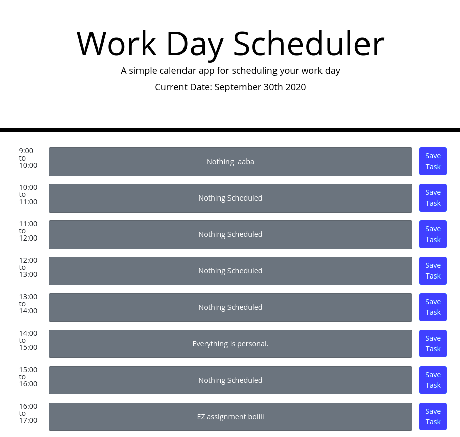

# [Work Day Scheduler](https://logner.github.io/work-scheduler)

This is the week 5 project from the University of Toronto SCS bootcamp. I have used jquery, bootstrap and moment.js for this project.

There may be some unfair/incorrect questions. If you find some questions or have suggestions for more, please let me know in the issues!!

as always - this is a responsive app!

This project is deployed at: https://logner.github.io/work-scheduler

